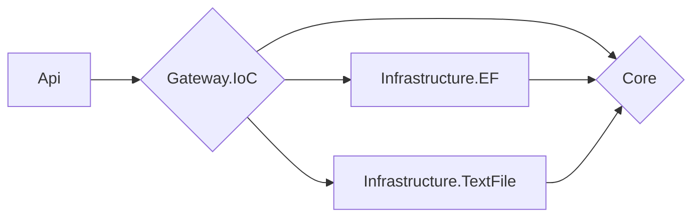

# Architecture
## Foundations
The project uses Clean Architecture, and its implementation is the one proposed by Microsoft (which also uses many of the concepts of DDD):  https://docs.microsoft.com/en-us/dotnet/architecture/modern-web-apps-azure/common-web-application-architectures#clean-architecture

## Application in this project
The architecture has a small change compared to the Microsoft proposal. To completely decouple the "Framework & Drivers" layer, an IoC Container was implemented as Gateway in a specific project. In this way, the API project only has a dependency on the IoC Container, and any changes in dependencies in the innermost layers are completely transparent to it.

The compile-time dependency chain looks like this:

The Gateway concept is part of the original version of Clean Architecture, proposed by Robert C. Martin: https://blog.cleancoder.com/uncle-bob/2012/08/13/the-clean-architecture.html

Although the projects in this refactoring are considerably less than those that would be used strictly using the original architecture (Rober C. Martin's, instead of Microsoft's), SOLID principles are followed, and above all, it depends on acidly on abstractions (interface segregation), so semantic separation in more projects would not be a serious problem.

# Refactoring of particular scenarios
## Gift functionality
To wrap the logic of each particular case of Gift for a User, depending on its Type, the Strategy Pattern was used.

In turn, since each strategy is used for a specific User Type (which implies that Strategy A is only used with Type A Users, and Strategy B with Type B, and their uses cannot be mixed), it is that the type of strategy was also specified, using the Marker/Tagging Pattern.

Side comment: it is considered that the Marker/Tagging pattern can be an anti-pattern, since it is a way of adding semantics to an entity without adding behavior, but in this case we consider it legal, since that semantic is vital for different roles in the business, and allows clear scalability (more User Types, more strategies, without problems).

Then, so that a consumer of Gifts for Users depending on their Type of User, does not have to be aware of the different strategies (to maintain the Single Responsibility Principle), a mediator is added, who will do exactly that job: know what strategy to use, depending on the Type of User.

