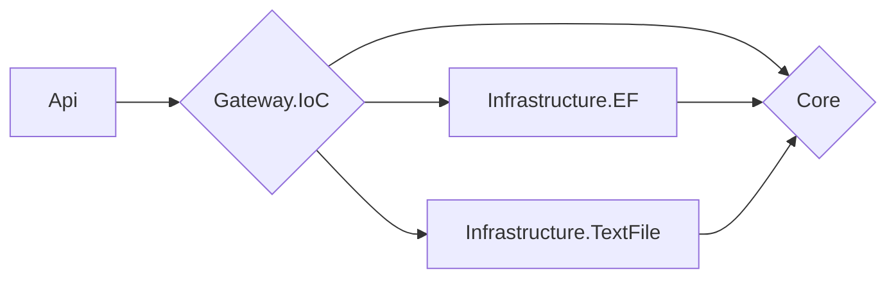

# Architecture
## Foundations
The project uses Clean Architecture, and its implementation is the one proposed by Microsoft (which also uses many of the concepts of DDD):  https://docs.microsoft.com/en-us/dotnet/architecture/modern-web-apps-azure/common-web-application-architectures#clean-architecture

## Application in this project
The architecture has a small change compared to the Microsoft proposal. To completely decouple the "Framework & Drivers" layer, an IoC Container was implemented as Gateway in a specific project. In this way, the API project only has a dependency on the IoC Container, and any changes in dependencies in the innermost layers are completely transparent to it.

The compile-time dependency chain looks like this:

The Gateway concept is part of the original version of Clean Architecture, proposed by Robert C. Martin: https://blog.cleancoder.com/uncle-bob/2012/08/13/the-clean-architecture.html

Although the projects in this refactoring are considerably less than those that would be used strictly using the original architecture (Rober C. Martin's, instead of Microsoft's), SOLID principles are followed, and above all, it depends on acidly on abstractions (interface segregation), so semantic separation in more projects would not be a serious problem.
