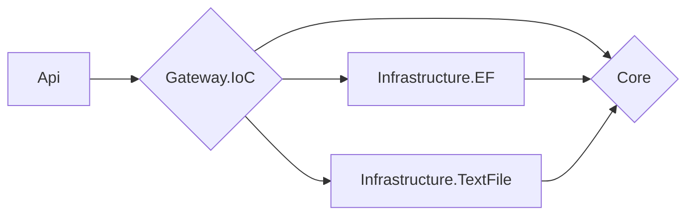

# Architecture
## Foundations
The project uses Clean Architecture, and its implementation is the one proposed by Microsoft (which also uses many of the concepts of DDD):  https://docs.microsoft.com/en-us/dotnet/architecture/modern-web-apps-azure/common-web-application-architectures#clean-architecture

## Application in this project
The architecture has a small change compared to the Microsoft proposal. To completely decouple the "Framework & Drivers" layer, an IoC Container was implemented as Gateway in a specific project. In this way, the API project only has a dependency on the IoC Container, and any changes in dependencies in the innermost layers are completely transparent to it.

The compile-time dependency chain looks like this:

The Gateway concept is part of the original version of Clean Architecture, proposed by Robert C. Martin: https://blog.cleancoder.com/uncle-bob/2012/08/13/the-clean-architecture.html

Although the projects in this refactoring are considerably less than those that would be used strictly using the original architecture (Rober C. Martin's, instead of Microsoft's), SOLID principles are followed, and above all, it depends on acidly on abstractions (interface segregation), so semantic separation in more projects would not be a serious problem.

# Refactoring of particular scenarios
## Gift functionality
To wrap the logic of each particular case of Gift for a User, depending on its Type, the Strategy Pattern was used.

In turn, since each strategy is used for a specific User Type (which implies that Strategy A is only used with Type A Users, and Strategy B with Type B, and their uses cannot be mixed), it is that the type of strategy was also specified, using the Marker/Tagging Pattern.

Side comment: it is considered that the Marker/Tagging pattern can be an anti-pattern, since it is a way of adding semantics to an entity without adding behavior, but in this case we consider it legal, since that semantic is vital for different roles in the business, and allows clear scalability (more User Types, more strategies, without problems).

Then, so that a consumer of Gifts for Users depending on their Type of User, does not have to be aware of the different strategies (to maintain the Single Responsibility Principle), a mediator is added, who will do exactly that job: know what strategy to use, depending on the Type of User.

Another side comment: We might think that the Factory Pattern would be appropriate here (and indeed it would be). But since we are employing the Dependency Inversion Principle, whereby a high-level class should not depend on a low-level one, we delegate the responsibility of instantiating elements to a dependency injector, so we rely on an abstraction.

## Email normalization
Since after investigating the functionality, we discovered that it was only applicable to the Gmail domain, a special purpose class (NormalizeEmail) was created to contain its functionality.

In turn, the NormalizeEmail class implements the INormalizeEmail interface, which defines as a contract that the Normalize method must be implemented, which receives a string, and returns a string.

Since the functionality is very concrete, a mechanism was not thought of in case of scalability (avoiding BDUF, Big Design Up Front).

In case the number of domains increases, then another strategy could be thought of to allow for scalability, as appropriate.

# Brief description of each assembly
## Sat.Recruitment.Api
It is a REST service, with CRUD operations for a User.

- It's documented with Swagger.
- Request/Response contracts are assembly specific, they do not expose domain entities.
- To transform domain entities into DTOs, uses AutoMapper.
- The logic of each Action is specific to the layer in which it is located (Frameworks & Drivers), and does not manage domain aspects at all.
- The validation of the received fields is carried out using decorations in each Request entity, or received parameter.

Important comment: the validation of the fields of the Request Entities is carried out in the API, but later in the business the validation of the User Entity is carried out.

## Sat.Recruitment.Gateway.IoC
We could say that it is a "Facade", which resolves the dependencies of the most internal layers, without exposing them to a consumer from outside.

In this way, any change that occurs further inside will be unknown by the layers above (as long as the established contracts are respected).

## Sat.Recruitment.Infrastructure
It is responsible for sending and receiving domain entities to a external storage. In this specific scenario, it will only be responsible for implementing the repositories defined in Core, with the corresponding underlying persistence technology.

- Sat.Recruitment.Infrastructure.TextFile: It implements the persistence system in a text file, as used in the original version of the system.
- Sat.Recruitment.Infrastructure.EF: It implements the persistence system in a SQL database -currently configured an in-memory database-, with Entity Framework as ORM.

How to switch between different Infrastructure implementations? Just comment/uncomment the container call of each implementation in the DependencyContainer file, of the Gateway.IoC assembly.

